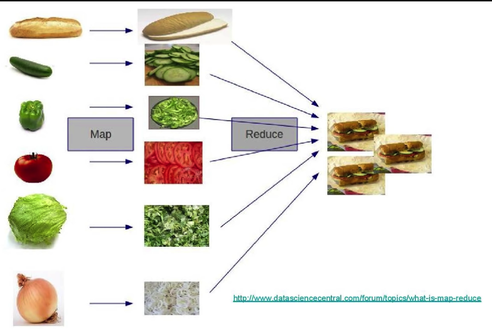

# 감사일기

1. 운전면허 시험을 대기하면서 앉아있을 수 있는 의자가 있어서 감사합니다. 다리에 문제없이 시험을 볼 수 있었습니다.
2. "삶은 어떻게 대응하는가의 문제이다."라는 조언을 알고 있어서 감사합니다. 오늘 운전면허 도로주행 시험에서 떨어졌습니다. 수요일에 3시간 다시 연습하고 3시간 다시 시험 대기를 해야 합니다. 이번주에 많은 활동을 하기 어렵게 만드는 실패입니다. 하지만 떨어진 구간만 다시 보면 이번주 목요일에 붙을 것을 압니다.
3. 부트텐트로 국비지원 부트캠프들을 한번에 볼 수 있어서 감사합니다. 부트캠프를 찾는 시간을 절약하고 예습에 쓸 수 있었습니다.

02:01

# 함수형 프로그래밍

[JavaScript로 함수형 프로그래밍 배우기 - Anjana Vakil - JSUnconf](https://www.youtube.com/watch?v=e-5obm1G_FY)

[영상 요약](https://velog.io/@young_mason/Functional-Programming-%EC%9A%94%EC%95%BD)

<p align="center">

</p>

> I've been programming for almost 40 years. That's the best explanation of map/reduce I've ever seen.

함수평 프로그래밍을 이해하는데 가장 직관적인 샌드위치입니다.

# git & github 배우기

```zsh
gst
```

oh my zsh를 설치하면 `git status` 대신에 입력할 수 있습니다.

```zsh
la
```

`ls -la`를 생략한 명령입니다. 똑같이 oh my zsh를 설치해야 쓸 수 있습니다.


