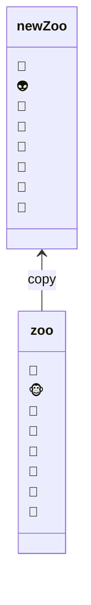
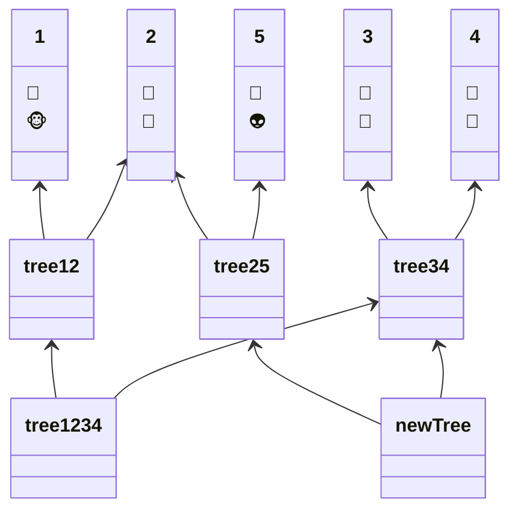

# 감사일기

1. 도서관 앞 카페의 아메리카노가 1,900원이어서 감사합니다. 단돈 1,900원만으로 잠 깨고 기분전환할 수 있었습니다. 무인카페랑 비슷한 수준으로 지출할 수 있었습니다.
2. 도서관에 휴게실이 있어서 감사합니다. 무인카페에서 컵라면을 수 없습니다. 도서관 휴게실에서는 식사를 할 수 있어서 오랫동안 있을 수 있었습니다.
3. 생활코딩이 있어서 감사합니다. 생활코딩으로 Ajax, immutable JavaScript를 배울 수 있었습니다.

04:21

# 생활코딩 리액트

업데이트란 Create + Read를 결합한 연산입니다.

react에서 onChange는 HTML의 onChange랑 다릅니다.

You provided 'value' prop to a form field without onChange handler

input을 그냥 업데이트하면 에러가 발생할 것입니다.

# Ajax란?

[생활코딩 WEB3-Ajax 재생목록](https://www.youtube.com/playlist?list=PLuHgQVnccGMA9-1PvblBehoGg7Pu1lg6q)


개발자 도구에서 Network 탭을 보면서 학습하는 것을 권장합니다.

Ajax는 리로드 없이 웹서버에게 정보를 요청해서 부분적으로 정보를 갱신해주는 기술입니다. 

검색창에 단어를 입력할 때마다 서버에서 부분적으로 요청합니다. 전체를 요청하거나 갱신하면 사용자의 관심은 다른곳으로 가고 컴퓨팅은 비효율적으로 낭비합니다.

asynchronous javascript and xml의 약자입니다.

사용자에게는 좋은 경험을 제공하고 서버를 운영하는 엔지니어는 비용을 줄여줄 수 있습니다.

## fetch API를 사용하는 법

```JavaScript
fetch('css').then((response)=>{
    response.text().then((text)=>{
        document.querySelector('article').innerHTML = text;
    })
})
```

`fetch('파일이름.확장자');`는 서버에게 파일을 요청하는 명령입니다.

`.then((response)=>{});`는 서버가 응답하고 있는 동안 실행하는 명령입니다. 실행할 명령은 인자로 들어가 있는 콜백화살표함수를 실행합니다.


해쉬는 `#`입니다. html에서 `id`값인 url로 접근합니다. `#`은 <strong>fragment identifier</strong>라고도 부릅니다.

```html
<a href="#three">three</a>

<p>
    Lorem ipsum dolor sit
</p>
<p>
    Lorem ipsum dolor sit
</p>
<p id="three">
    Lorem ipsum dolor sit
</p>
```

위 링크를 클릭하면 최하단으로 이동합니다.

```JavaScript
location.hash
```

해쉬값을 가져오는 방법입니다.
```JavaScript
location.hash.substr(1);
```

```html
<a href="#!주소"></a>
```

`#`만 입력해도 인식할 수 있지만 사람이 읽을 때 관례상 `#!`으로 작성합니다.

AJAX의 단점은 SEO에 불리합니다. 서버에서 동적으로 가져오기 때문에 크롤러가 모릅니다.

SEO가 중요하면 PJAX를 공부하는 것도 방법입니다.

과거 브라우저 호환문제를 해결하기 위해 `polyfill` 라이브러리 사용해야 합니다.

```url
https://github.com/github/fetch
```

파일을 추가해서 넣어놓고 `head` 태그에 `script` 태그를 추가하면 됩니다.

```html
<head>
    <script src="./fetch/fetch.js"></script>
</head>
```

ajax를 마저 공부하면 XML, JSON을 공부하면 됩니다. 웹 엔지니어에게는 JSON을 권장합니다.


# JavaScript Immutability

[Anjana Vakil: Immutable data structures for functional JS | JSConf EU](https://www.youtube.com/watch?v=Wo0qiGPSV-s)

간단한 Immutable를 해결하는 방법은 copy하는 것입니다. 바뀐 부분만 수정하고 새로운 자료를 만드는 것입니다. 당연히 프로그래밍 지식이 있으면 시간복잡성과 공간복잡성 낭비가 크다는 것을 알 수 있습니다.

트리구조를 공유만 잘하면 됩니다.

트리는 배열을 나풋잎(leaf)에 담아놓는 방법입니다.

pathcopying 방법입니다.

공간복잡도를 줄일 수 있습니다.



trie tree 자료구조를 활용합니다. leaf가 정보를 저장합니다. 바이너리로 취급하고 접근할 수 있습니다. 현실에서는 32가지를 보게 될 것입니다.

class 1 대시 5를 선택하기 위해 일부 노드만 바뀌었습니다. 그리고 전체를 복사할 필요가 없어졌습니다.

노드가 크거나 깊거나 사이 교환을 결정해야 합니다. 32정도는 효율적이라고 합니다.

다른 방법은 key를 가지고 해싱로 변환하고 바이너리 할 수 있습니다.

hash array mapped trie라고 볼 수 있습니다.


[생활코딩 JavaScript Immutability 재생목록](https://www.youtube.com/playlist?list=PLuHgQVnccGMBxNK38TqfBWk-QpEI7UkY8)

프로젝트 초기에는 필요 없을 수 있습니다. 혼자하는 작은 사이드 프로젝트에서도 필요 없을 수 있습니다. 하지만 규모가 크면 반드시 필요한 자바스크립트 프로그래밍 개념입니다.

정보의 원본이 변화하지 않는 방법을 다루는 과정입니다.

정보연산은 다시말하지만 4가지입니다. 생성, 읽기, 수정, 삭제입니다.

여기서 생성, 읽기 2가지가 중요합니다. 생성할 수 있어야 하고 읽을 수 있어야 수정삭제가 가능합니다.

모든 정보시스템을 처음 접하고 공부할 때 2가지를 아주 잘 하면 됩니다. 생성과 읽기입니다.

컴퓨터의 정보 CRUD 연산은 너무 자유로워서 버그가 발생하기 쉽습니다. 그래서 제어하는 법을 배워야 합니다. 불변함과 가변함을 완전히 통제하는 엔지니어로 거듭날 수 있어야 합니다. 자바스크립트를 중심으로 배우는 웹 엔지니어는 당연합니다.

```JavaScript
var v = 1;
```

`v`는 값의 이름입니다. `1`은 값입니다.

전산을 공부할 때는 항상 극단으로 고려해야 합니다.


자바스크립트를 어떤 방식으로 가르키고 있는지 파악하고 있어야 적은 기억으로 많은 문제를 해결할 수 있습니다.


자바스크립트의 원시형과 참조형(객체)이 있습니다. 참조형은 원시형을 정리정돈하는데 사용합니다.

원시형과 참조형에 따라 자바스크립트가 다루는 방식이 완전히 다릅니다.


```JavaScript
var p1 = 1;
var p2 = 1;
console.log(p1 ,p2 , p1===p2);  // 1, 1, true
```
원시형의 값이 같으면 메모리상의 주소도 같습니다.
원시형은 바뀔 수 없습니다. 그래서 immutable이라고 합니다.


```JavaScript
var o1 = {name:'kim'}
var o2 = {name:'kim'}
console.log(o1,o2,o1===o2);  // {name:'kim'}, {name:'kim'}, false
```
객체는 값이 같아도 각자 다른 메모리 주소를 가집니다.
객체는 값이 가변적이기 때문입니다.

값이 가변적일 수 있을 때 생기는 문제들이 있습니다.
객체는 property를 통해 변경할 수 있어서 많은 문제들이 생깁니다.

```JavaScript
var 복사본 = Object.assign({}, 원본)
```

객체를 복제하는 방법입니다.

Nested Object도 문제가 있습니다.
`Object.assign()`을 하면 객체의 값을 복사하는 것이 아니라 메모리 주소를 복사하는 것입니다. 생길 수 있는 문제는 복사를 했다고 마음대로 수정할 수 있다고 착각할 수 있습니다.
해결책은 안에 있는 객체까지 복사하는 것입니다.

배열은 `concat()`, `slice()`로 복제하면 됩니다.

```JavaScript

function fn(person) {
    person.name = "lee";
};
var o1 = { name : "kim" };
fn(o1);
console.log(o1);  // 의도하지 않은 사이드이팩트가 발행: 원본 { name : "kim" }이 { name: 'lee' }으로 바뀜
```

```JavaScript
function fn(person) {
    person.name = "lee";
};
var o1 = { name : "kim" };  //  o1.name === "kim"
var o2 = Object.assign({}, o1);  // o2.name === "kim"
fn(o2);  // o2.name === "lee"
console.log(o1, o2);  // { name: 'kim' } { name: 'lee' }
```
위 함수는 데이터에 mutation을 가하는 함수입니다.

가변, 불변 API도 존재합니다.

복제를 할 때마다 성능은 엄청나게 떨어집니다. 그래서 복제만 하는 것은 꼭 좋은 방법이 아닙니다.

데이터 뮤테이션을 원천적으로 막아야 할 때도 있습니다.


const vs object freeze
이 논쟁은 유명한 논쟁입니다.
const는 변수명이 다른 것을 못 가르키게 하는 명령입니다.
object freeze는 값을 변경할 수 없게 하는 명령입니다.


이 개념들을 이해하면 함수형 프로그래밍을 시작할 수 있습니다.
또 리액트를 다시 공부해보는 것도 권장합니다.