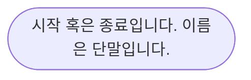
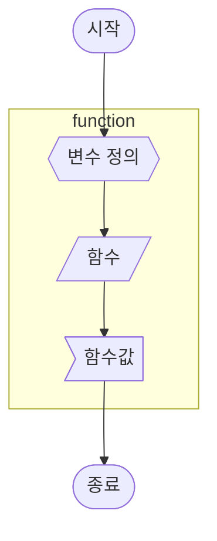

# 감사일기

1. 유데이에서 할인 이벤트를 해주어서 감사합니다. 유데미에서 강의를 15,000원에 구매할 수 있게 할인해주었습니다. MERN 스택을 공부할 수 있는 자료가 생겼습니다.
2. Flex froggy을 알 수 있어서 감사합니다. Flex로 CSS 레이아웃을 공부할 수 있었습니다.
3. mermaid차트가 알고리즘 표현을 위한 대부분의 세트를 지원해주어서 감사합니다. 알고리즘을 손으로 안 쓰고 컴퓨터에 쉽게 보관할 수 있게 되엇습니다.

02:40

# 모르는 것을 알아내기

MERN stack 프론트엔드 엔지니어가 추구해야 하는 기술 스택입니다. Mongo.DB, Express.js, React.js, Node.js 입니다. 모두 자바스크립트를 활용합니다. 기본, 깊이있는 지식이 있어야 응용할 수 있습니다.

리액트에서 SVG 아이콘 활용하기
https://velog.io/@juno7803/React-React%EC%97%90%EC%84%9C-SVG-%ED%99%9C%EC%9A%A9%ED%95%98%EA%B8%B0

리액트에 아이콘을 추가하는 것부터 어려웠습니다.

Styled Component활용하기
스타일드 컴포넌트 추가하는 법을 몰랐습니다.
벨로퍼트에서 템플릿 리터럴 활용 법 중 흥미로운 부분을 보여주었습니다. 이부분을 처음 봤습니다.


javascript참조형 자료에는 set, map, weakmap, weakset도 존재합니다.


28. React 환경 세팅 및 Hook & State & Props

29. React Component 만들기 & 배열 사용

30. 입력처리 & useRef 활용 & Crud 구현

31. useEffect & Memo & react.memo 성능개선 & To-do App 구현 실습

32. React 페이지 라우팅 & 쇼핑몰 페이지 구현 실습

33. Redux 상태관리 & 쇼핑몰 장바구니 구현 실습

34. Redux를 활용한 Crud 구현

35. StyledComponent를 활용한 CSS 구현 & 오픈 API 활용법

43. 기본 TypeScript & 변수와 함수 타입 정의하기

44. TypeScript 인터페이스

45. TypeScript 이넘 & 제네릭

46. TypeScript 추론 & 단언 & 가드

47. TypeScript 호환

48. TypeScript 모듈화

49. 리액트에 타입스크립트 적용하기

# 기본 CS 지식

리스프(LISP)라는 프로그래밍 일반론적인 개념이 존재합니다.

브라우저에서 url에서 구글.com을 입력하면 일어나는 일
이 질문은 면접 질문 중 하나입니다. 클라이언트 다른 말로 사용자가 url에 google.com을 입력하면 컴퓨터의 브라우저는 인터넷 통신망으로 신호를 줍니다. 통신망은 인터넷 서비스 제공업체에게 신호를 보냅니다. 인터넷 서비스 제공업체는 DNS로 보냅니다. DNS는 IP주소를 확인하고 인터넷 척추망을 통해서 해당하는 IP 주소에서 서버에 신호를 보냅니다. 

인터넷은 연결한 전반적인 인프라라고 할 수 있습니다.

프로그래밍 순서도를 그리는 방법을 배워야 합니다. 시각적, 절차적으로 복잡성을 낮추는 노하우입니다. 물론 무조건 하는 것이 좋은 것은 아니지만 배우면서 지출하는 비용대비 얻을 수 있는 프로그래밍 사고력이 훨씬 더 큽니다.





영역을 정의할 수 있습니다.


# 함수형 프로그래밍 시작하기

함수는 일급객체입니다. 혹은 최소한 그렇게 취급해야 합니다.

```JavaScript
function add(x, y) {  // 함수 선언형
  return x + y;
}
```
일반적인 함수 선언 방식입니다.

```JavaScript
const add = (x, y) => {
    return x + y;
};
```
자바스크립트를 오랫동안 배웠으면 자주봤을 함수 표현식입니다. 변수에 함수를 할당하는 행위자체가 다양한 가능성을 만들어줍니다. 이렇게 되면 함수 자체를 인자로 넣을 수 있습니다.

```JavaScript
function greet(saluation, firstName) {
    return `${saluation}, ${firstName}`;
}
```
고전적으로 함수를 작성하는 방식입니다. 인자를 2개를 넣어야 활용할 수 있습니다. 처음 공부하는 사람에게는 상당히 직관적일 것입니다.

```JavaScript
const greet = (saluation) => {
    return (firstName) => {
        return `${saluation}, ${firstName}`;
  };
};
```
하지만 함수형 프로그래밍에서는 이렇게 활용합니다. 바로 보면 직관적이지 않습니다. 무슨 장점이 있는지 의문이 생길 수 있습니다.


```JavaScript
const hi = greet("hi");
const mahalo = greet("mahalo");

// 함수형 프로그래밍의 장점
console.log(hi("JavaScript")); // hi, JavaScript
console.log(mahalo("React")); // mahalo, React

// 자바스크립트 함수 표현식 면접 질문
console.log(greet("hello")("john doe")); // hello, john doe
```

`hi`을 변수 선언하는 것으로 인자를 넣는 행위를 하나 아낄 수 있습니다. 만약 `hi`를 자주 사용하고 인자에 사람이름이 자주 바뀌면 재사용성이 아주 좋은 함수입니다.
자바스크립트가 함수 표현식으로 변수에 함수를 넣는 행위가 가능해지면서 발생하는 특이한 표현 방식이 있습니다. `functionName(param)(param)`이런 스타일의 코드가 나옵니다. 이런 함수를 실무에서 사용은 안 하지만 면접 질문으로 의도적으로 만들라고 할 수 있습니다.

참고로 `functionName(param)(param)`를 보고 이해할 수 없으면 자바스크립트 기초부터 다시 공부해야 합니다.


# 09월 회고

## Liked
- 생활코딩으로 작은 과정으로 공부하는 것은 생각보다 재미있었습니다. 작은 과정으로 쪼개서 임했던 것이 효과를 잘 발휘했던 것입니다.

## Learned
- mermaid 사용법을 많이 익혔습니다. 그림을 마크업으로 그릴 수 있게 되었습니다.
- 공부도 작고 구체적인 것이 좋다는 것을 배웠습니다.
- addEventListener를 다루기 시작할 수 있었습니다.
- 감사일기는 정신건강에 좋습니다.
- Vim은 백엔드 공부를 시작하고 터미널을 많이 만져야 할 때 공부를 시작해야 겠습니다.

## Lacked
- 집중하는 시간이 적은 경우가 너무 많았습니다. 많이 투입한다고 많이 배우는 것은 아닙니다. 어느정도를 넘기는게 비효율적인지 파악을 못하고 있습니다.
- 일찍 일어나서 도서관에서 자리잡는 것이 부족했습니다. 자리 선정하면서 시간 낭비를 많이 했습니다.

## Longed(원하는 것)
- 바닐라 자바스크립트로 목표로 했던 완전한 ToDoList App만들고 싶습니다.
- React를 잘 다루고 싶습니다.
- 함수형 자바스크립트 프로그래밍을 더 공부하고 싶습니다.
    - 함수형 코딩을 읽고 싶습니다.
    - Underscore.js를 이해하고 싶습니다.

## Action Item
- 결재한 온라인 강의를 활용합니다. 
    - 【한글자막】 The Web Developer 부트캠프 2022
    - The Complete 2022 Web Development Bootcamp
- 벨로퍼트 React과정 따라하기
- React Course - Beginner's Tutorial for React JavaScript Library [2022]로 공부하기
- 코어 자바스크립트 강의랑 병렬로 듣고 읽고 복습하기

