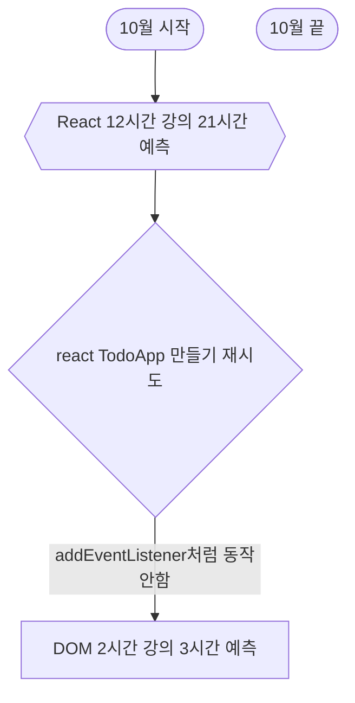

# 202210 Summary

|  월  | 1월 | 2월 | 3월 | 4월 | 5월 | 6월 | 7월 | 8월 | 9월 | 10월 | 11월 | 12월 |
|:--:|:--:|:--:|:--:|:--:|:--:|:--:|:--:|:--:|:--:|:--:|:--:|:--:|
|01일  |    |    |    |    |    |    |    |    |    |    |    |    |
|02일  |    |    |    |    |    |    |    |    |    |    |    |    |
|03일  |    |    |    |    |    |    |    |    |    |    |    |    |
|04일  |    |    |    |    |    |    |    |    |    |    |    |    |
|05일  |    |    |    |    |    |    |    |    |    |    |    |    |
|06일  |    |    |    |    |    |    |    |    |    |    |    |    |
|07일  |    |    |    |    |    |    |    |    |    |    |    |    |
|08일  |    |    |    |    |    |    |    |    |    |    |    |    |
|09일  |    |    |    |    |    |    |    |    |    |    |    |    |
|10일  |    |    |    |    |    |    |    |    |    |    |    |    |
|11일  |    |    |    |    |    |    |    |    |    |    |    |    |
|12일  |    |    |    |    |    |    |    |    |    |    |    |    |
|13일  |    |    |    |    |    |    |    |    |    |    |    |    |
|14일  |    |    |    |    |    |    |    |    |    |    |    |    |
|15일  |    |    |    |    |    |    |    |    |    |    |    |    |
|16일  |    |    |    |    |    |    |    |    | ✅ |    |    |    |
|17일  |    |    |    |    |    |    |    |    | ✅ |    |    |    |
|18일  |    |    |    |    |    |    |    |    | ✅ |    |    |    |
|19일  |    |    |    |    |    |    |    |    | ✅ |    |    |    |
|20일  |    |    |    |    |    |    |    |    | ✅ |    |    |    |
|21일  |    |    |    |    |    |    |    |    | ✅ |    |    |    |
|22일  |    |    |    |    |    |    |    |    | ✅ |    |    |    |
|23일  |    |    |    |    |    |    |    |    | ✅ |    |    |    |
|24일  |    |    |    |    |    |    |    |    | ✅ |    |    |    |
|25일  |    |    |    |    |    |    |    |    | ✅ |    |    |    |
|26일  |    |    |    |    |    |    |    |    | ✅ |    |    |    |
|27일  |    |    |    |    |    |    |    |    | ✅ |    |    |    |
|28일  |    |    |    |    |    |    |    |    | ✅ |    |    |    |
|29일  |    |    |    |    |    |    |    |    | ✅ |    |    |    |
|30일  |    |    |    |    |    |    |    |    | ✅ |    |    |    |
|31일  |    |    |    |    |    |    |    |    |    |    |    |    |
|계    |    |    |    |    |    |    |    |    | 15 |    |    |    |

---
# 커리큘럼

React Course - Beginner's Tutorial for React JavaScript Library [2022] 수강

