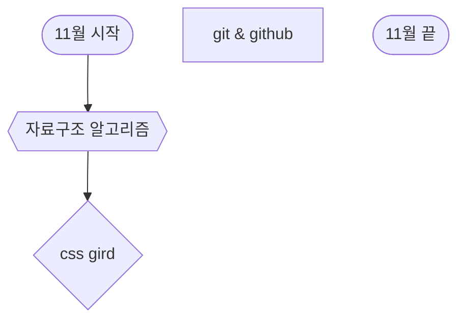

# 202210 Summary

|  월  | 01월 | 02월 | 03월 | 04월 | 05월 | 06월 | 07월 | 08월 | 09월 | 10월 | 11월 | 12월 |
| :--: | :--: | :--: | :--: | :--: | :--: | :--: | :--: | :--: | :--: | :--: | :--: | :--: |
| 01일 |      |      |      |      |      |      |      |      |      |  ✅  |  ✅  |      |
| 02일 |      |      |      |      |      |      |      |      |      |  ✅  |  ✅  |      |
| 03일 |      |      |      |      |      |      |      |      |      |  ✅  |  ✅  |      |
| 04일 |      |      |      |      |      |      |      |      |      |  ✅  |  ✅  |      |
| 05일 |      |      |      |      |      |      |      |      |      |  ✅  |  ✅  |      |
| 06일 |      |      |      |      |      |      |      |      |      |  ✅  |  ✅  |      |
| 07일 |      |      |      |      |      |      |      |      |      |  ✅  |  ✅  |      |
| 08일 |      |      |      |      |      |      |      |      |      |  ✅  |  ✅  |      |
| 09일 |      |      |      |      |      |      |      |      |      |  ✅  |  ✅  |      |
| 10일 |      |      |      |      |      |      |      |      |      |  ✅  |  ✅  |      |
| 11일 |      |      |      |      |      |      |      |      |      |  ✅  |  ✅  |      |
| 12일 |      |      |      |      |      |      |      |      |      |  ✅  |      |      |
| 13일 |      |      |      |      |      |      |      |      |      |  ✅  |  ✅  |      |
| 14일 |      |      |      |      |      |      |      |      |      |  ✅  |      |      |
| 15일 |      |      |      |      |      |      |      |      |      |  ✅  |      |      |
| 16일 |      |      |      |      |      |      |      |      |  ✅  |  ✅  |      |      |
| 17일 |      |      |      |      |      |      |      |      |  ✅  |  ✅  |      |      |
| 18일 |      |      |      |      |      |      |      |      |  ✅  |  ✅  |      |      |
| 19일 |      |      |      |      |      |      |      |      |  ✅  |  ✅  |      |      |
| 20일 |      |      |      |      |      |      |      |      |  ✅  |  ✅  |      |      |
| 21일 |      |      |      |      |      |      |      |      |  ✅  |  ✅  |      |      |
| 22일 |      |      |      |      |      |      |      |      |  ✅  |  ✅  |      |      |
| 23일 |      |      |      |      |      |      |      |      |  ✅  |  ✅  |      |      |
| 24일 |      |      |      |      |      |      |      |      |  ✅  |  ✅  |      |      |
| 25일 |      |      |      |      |      |      |      |      |  ✅  |  ✅  |      |      |
| 26일 |      |      |      |      |      |      |      |      |  ✅  |  ✅  |      |      |
| 27일 |      |      |      |      |      |      |      |      |  ✅  |  ✅  |      |      |
| 28일 |      |      |      |      |      |      |      |      |  ✅  |  ✅  |      |      |
| 29일 |      |      |      |      |      |      |      |      |  ✅  |  ✅  |      |      |
| 30일 |      |      |      |      |      |      |      |      |  ✅  |  ✅  |      |      |
| 31일 |      |      |      |      |      |      |      |      |      |  ✅  |      |      |
|  계  |      |      |      |      |      |      |      |      |  15  |  31  |      |      |

---

# 커리큘럼

