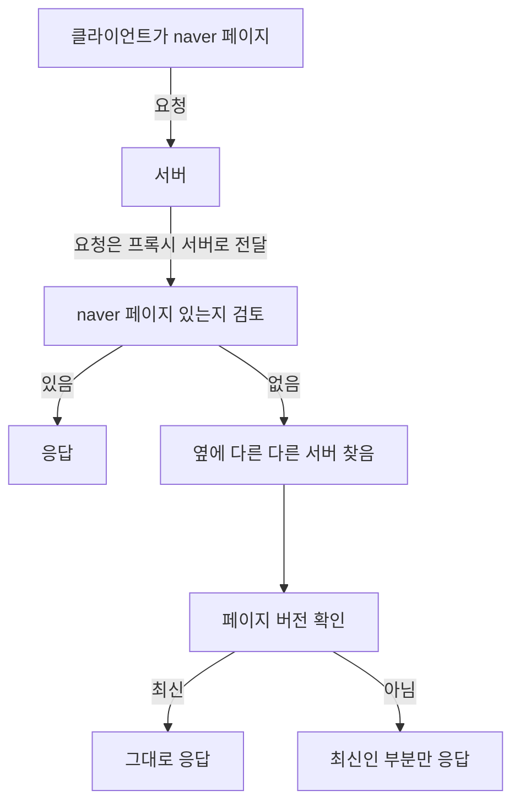

# TIL

1일1커밋 무사고: 237일차

06:37

## todo

- [ ] flash card backend mongoDB
- [x] 용어 줍줍 Proxy 서버
- [x] 블로그
  - [x] 1.0.0-alpha 회고 추가
  - [x] 이스터에그 추가
- [x] 이력서
  - [x] 1뽀모도로
  - [x] 1뽀모도로
- [x] flash card front doc
  - [x] card side 로직 숨기기
  - ~~axios token refresh and retry 보여주기~~
  - [x] 래퍼런스 보여주기

## Proxy 서버

일단 Proxy가 대리인이라는 것은 알고 있습니다.

> 프록시 서버(영어: proxy server 프록시 서버[*])는 클라이언트가 자신을 통해서 다른 네트워크 서비스에 간접적으로 접속할 수 있게 해 주는 컴퓨터 시스템이나 응용 프로그램을 가리킨다. 서버와 클라이언트 사이에 중계기로서 대리로 통신을 수행하는 것을 가리켜 '프록시', 그 중계 기능을 하는 것을 프록시 서버라고 부른다.
>
> \- 위키피디아(wikipedia)

서버와 클라이언트 중간에 위치합니다. 클라이언트를 위한 대리인이라고 볼 수 있습니다.

레거시 시스템에서는 캐싱을 유지하지만 최근(2023년)에는 CDN이 역할을 대신합니다.

[Proxy vs Reverse Proxy (Real-world Examples)](https://www.youtube.com/watch?v=4NB0NDtOwIQ)

클라이언트를 위한 proxy를 보고 forward proxy라고 부릅니다. 클라이언트의 요청을 모두 받아 웹 서버로 요청을 보내주면서 클라이언트의 익명성을 확보할 수 있게 됩니다. 클라이언트 요청 ip 주서는 proxy에 남고 웹서버는 proxy 서버 ip 주소가 남기 때문입니다.

revers proxy는 서버를 위한 proxy 서버입니다. 웹서버가 단일 웹서버만 존재하지 않습니다. 여러개의 웹서버가 존재하는데 이 요청을 나누어주는 로드벨러 역할을 하는 서버입니다.

## flash card

https://ko.vitejs.dev/config/server-options.html#server-proxy

vite에서 proxy 서버를 만드는 방법도 알려줬습니다.
