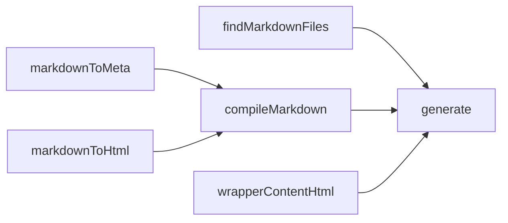

# 블로드 다시 만들기 12일차

1일1커밋 무사고: 943일차

## 감사일기

1. ???

## todo

- [ ] 블로그 다시 만들기 전 실험
  - [ ] 블로그 글 작성 준비
  - [ ] 마크다운 편집하면 새롭게 html 생성
    - [x] 마크다운을 저장 시점에 html에 반영 
    - [ ] `data.json` 부분 반영
  - [ ] content에서 이미지관리할 방법 찾기
  - [ ] 검색 만들기
  - [ ] 코드 복사 다시 만들기
- [ ] 데이터 시각화 옵시디언으로 마이그레이션
  - [ ] 비중
    - [x] 서클 패킹(Circle packing)
    - [x] 선버스트 차트(Sunburst Chart, Mulit-level Pie chart, Radial Treemap, Adjacency diagram, icicle chart)
    - [ ] 히스토그램(Histogram)
    - [ ] 점 나열 차트(Dot Strip Plot, Strip Plot)
    - [ ] 상자 수염 그림(Box and Whisker plot, Box plot)
  - [ ] 관계
    - [ ] 산점도(Scatter plot)
    - [ ] 버블 차트(Bubble chart)
    - [ ] 평행 좌표(Parallel Coordinates)
    - [ ] 생키 다이어그램(Sankey diagram, Alluvial diagram)
    - [ ] 패러럴 셋(Parallel Sets)
    - [ ] 코드 다이어그램(Chord Diagram, Radial network diagram)
    - [ ] 네트워크 시각화(social network diagram)
  - [ ] 위치
    - [ ] 점 밀집도(Dot Density map, Dot Distribution map, Location map, Dot map)
    - [ ] 도형표현도(Symbol map, Proportional symbol map, Graduated symbol map)
    - [ ] 단계 구분도(Field map, Choropleth map)
    - [ ] 히트 맵(Heat map)
    - [ ] 등고선 지도(Contour map, lsarithmic map, Isochrone map, Isopleth map)
    - [ ] 연결 지도(Connection map, Link map)
    - [ ] 이동 경로 지도(Route map)
    - [ ] 흐름 지도(Flow map)
    - [ ] 카토그램(Cartogram)
    - [ ] 돌링 카토그램(Dorling Cartogram, Dorling map)
    - [ ] 타일 격자 지도(Tile Grid map, Grid map, Equal-area cartogram)

---

## 마크다운 편집이 있으면 즉시 반영하기

- 저의 목표는 제가 마크다운 파일을 편집하면 vite는 해당하는 그 파일만 html을 다시 생성하는 행동을 하기를 원합니다.
- `handleHotUpdate` 예전에 vite에 이 hook 있다는 것을 발견했습니다.
  - https://ko.vite.dev/changes/hotupdate-hook
  - 공식 문서를 확인해보면 7.0부터 지원 중단이 예고 되어 있습니다.
  - 제가 설치할 때 vite 버전은 7.0이었습니다.
  - `hotUpdate`를 대신 사용하라고 하니까 대신 사용할 것입니다.

```ts
export default defineConfig(async ({}) => {
  return {
    plugins: [
      {
        name: "complel markdown to html when dev start",
        async hotUpdate({ type, modules }) {
          console.log("modules", modules, type);
          return [];
        },
      },
    ],
  };
});
```

- 위처럼 작성하고 마크다운을 저장하니까 커맨드라인에 출력이 되었습니다.
- 이제 해야 하는 것은 파일 생성, 파일 삭제, 파일 갱신처럼 모든 이벤트를 처리하면 됩니다.
- 처리할 파일의 경로를 감지하고 해당하는 파일의 html만 다시 만들면 됩니다.

```ts
interface HotUpdateOptions {
  type: "create" | "update" | "delete";
  file: string;
  timestamp: number;
  modules: Array<EnvironmentModuleNode>;
  read: () => string | Promise<string>;
  server: ViteDevServer;
}
```

- 일단 공식문서에서 무슨 정보를 주는지 단번에 알 수 있어서 다행입니다.
- 타입스크립트의작이 애매한 부분이 많습니다. `hotUpdate`의 매개변수를 접근하는데 javascript object destructuring으로 접근할 때는 자동완성이 잘 지원되고 있습니다.
  - 함수의 몸에 변수를 활용하면 자동완성이 잘 안 되고 다 `any`로 간주하고 있었습니다.
  - 아직 vite 개발팀의 타입 기계체조 실력이 부족한 것으로 보입니다.
- 일단 지금 중요한 것은 2가지 객체의 속성입니다. `type`, `file`
  - `type`으로 `create`, `update`, `delete`을 감지하는 것이 가능해졌습니다.
  - `file`으로 갱신할 확장자를 감지할 수 있습니다.
  - 하지만 `generate` 함수의 역할을 다시 생각해보게 됩니다.
    - `generate`는 `content`하위에 속한 모든 파일을 순회하고 난 뒤에 html 파일을 생성합니다.
    - 제가 원하는 것은 특정 마크다운 파일을 기준으로 하나의 html 파일만 생성, 수정, 삭제하는 것입니다.
- `data.json`은 항상 갱신하면 될 것 같습니다.
  - 고려할 사항을 나중으로 미루어둬도 될 것 같습니다. 저에게 중요한 개발 경험은 제가 모든 것을 제어한다는 점입니다.

```ts
const generate = async (dir: string, ctx: "development" | "production") => {
  const srcDir = path.resolve(dir, "content"); // *.md 모아둔 곳
  const outBlogDir = path.resolve(dir, "public/blog");

  // 1) public/blog 디렉터리 초기화
  fs.rmSync(outBlogDir, { recursive: true, force: true });
  fs.mkdirSync(outBlogDir, { recursive: true });

  // 2) 모든 markdown 찾기
  const mdFiles = findMarkdownFiles(srcDir);

  const data: Data = { blog: [] };

  // 3) 변환 & 저장
  for (const mdFile of mdFiles) {
    const markdown = fs.readFileSync(mdFile, "utf8");
    const { meta: meta, content } = await compileMarkdown(markdown);

    switch (ctx) {
      case "production":
        if (!meta.title || meta.draft) continue;
        break;
      case "development":
        if (!meta.title) continue;
        break;
      default:
        break;
    }

    const outPath = mdFile
      .replace(/\.md$/, ".html")
      .replace("content", "public/blog");

    const relativePath = path.relative(__dirname, outPath);

    meta.htmlPath = relativePath.slice(9);
    data.blog.push(meta);

    fs.mkdirSync(path.dirname(outPath), { recursive: true });

    const contentWrapper = wrapperContentHtml(meta.title, content);

    fs.writeFileSync(outPath, contentWrapper, "utf8");
  }

  const outPublicDir = path.resolve(dir, "public");

  const saveData = JSON.stringify(data);

  fs.mkdirSync(path.dirname(outPublicDir), { recursive: true });
  fs.writeFileSync(`${outPublicDir}/data.json`, saveData, "utf8");
};
```



- 콜그래프를 그려보면 위처럼 나옵니다.
- 지금 필요한 설계는 파일의 이름과 주소를 전달하면 html 파일 새롭게 갱신 로직만 처리하면 됩니다.
- generate의 역할은 모든 파일을 삭제하고 기존에 파일이름과 주소를 받으면 html을 생성하는 함수를 의존하도록 설계하면 됩니다.
- https://ko.vite.dev/guide/api-hmr.html#required-conditional-guard
  - 문서에서 hmr 제어를 위해 제공하는 것들을 발견할 수 있었습니다.

```ts
export default defineConfig(async ({}) => {
  return {
    plugins: [
      {
        name: "compile markdown to html when dev start",
        async hotUpdate({ type, file }) {
          if (!file.endsWith(".md") || !file.startsWith(`${__dirname}/content`))
            return;

          switch (type) {
            case "create":
              break;
            case "update":
              const markdown = fs.readFileSync(file, "utf8");
              const { meta, content } = await compileMarkdown(markdown);

              const contentWrapper = wrapContentToHtml(meta.title, content);

              const outPath = file
                .replace(/\.md$/, ".html")
                .replace("content", "public/blog");

              fs.writeFileSync(outPath, contentWrapper, "utf8");
              break;
            case "delete":
              break;
            default:
              break;
          }
        },
      },
    ],
  };
});
```

- 위에서 파일 업데이트를 감지하고 부분적으로 html을 갱신하는 방법을 알아냈습니다.
- 코드를 보니까 플러그인 이름은 변경할 필요가 있을 것 같습니다.
- 사이드이펙트인 파일 쓰기랑 `data.json`을 생성하기 위해 값을 반환한다는 점이 뭔가 찝찝하다는 생각이 듭니다.
- 지금 수준에서 정말 DRY가 중요한가? 라는 의문도 들기도 합니다.
- 아니면 그냥 찝찝하게 설계해도 됩니다.
- `html`도 파일 하나 새롭게 갱신하고 `data.json`도 새롭게 갱신하면 되기는 합니다.
  - 그래봤자 파일 2개 쓰기입니다.
  - `data.json`의 특정 부분만 쓰기를 위해서는 node.js에서 개발하는 동안에 서버 내에서 상태를 들고 있어야 할 것으로 생각됩니다.

```ts
const markdown = fs.readFileSync(mdFile, "utf8");
const { meta: meta, content } = await compileMarkdown(markdown);

switch (ctx) {
  case "production":
    if (!meta.title || meta.draft) continue;
    break;
  case "development":
    if (!meta.title) continue;
    break;
  default:
    break;
}

const outPath = mdFile
  .replace(/\.md$/, ".html")
  .replace("content", "public/blog");

const relativePath = path.relative(__dirname, outPath);

meta.htmlPath = relativePath.slice(9);
data.blog.push(meta);

const contentWrapper = wrapContentToHtml(meta.title, content);

fs.mkdirSync(path.dirname(outPath), { recursive: true });
fs.writeFileSync(outPath, contentWrapper, "utf8");
```

```ts
if (!file.endsWith(".md") || !file.startsWith(`${__dirname}/content`)) return;

switch (type) {
  case "create":
    break;
  case "update":
    const markdown = fs.readFileSync(file, "utf8");
    const { meta, content } = await compileMarkdown(markdown);

    const contentWrapper = wrapContentToHtml(meta.title, content);

    const outPath = file
      .replace(/\.md$/, ".html")
      .replace("content", "public/blog");

    fs.writeFileSync(outPath, contentWrapper, "utf8");
    break;
  case "delete":
    break;
  default:
    break;
}
```

- '읽기 -> 판단 -> 쓰기'라는 점에서 제가 설계를 잘못하고 있을 수 있습니다.
- 실행되는 맥락에 따라 다른 결과를 내야 합니다. 하나는 html을 저장만 해야 하고 다른 하나는 `draft`인지 여부를 판단하고 html 쓰기를 지원할지 말지 결정해야 합니다.
- 관리 지점도 이슈가 됩니다. 지금은 제가 `public/blog`라고 명명했는데 `post`로 변경하고 싶으면 검색으로 변경하고 확인하고 처리해야 할 부분이 많습니다.
- 함수를 쪼개는 기준을 더 잘게 나눠야 할 것 같습니다.

