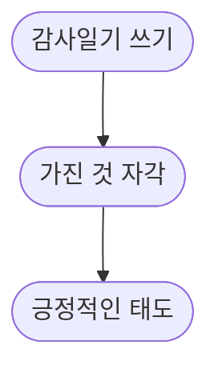

# 템플릿

```txt
1일1커밋 무사고: 000일차

# 감사일기

1. ???
2. ???
3. ???

00:00

# todo

- [ ]
```

1. 어떤 문제가 있었는지
2. 내가 시도해본 것들
3. 어떻게 해결했는지
4. 뭘 새롭게 알았는지

```txt
# error log

## 에러 제목

### 문제: ???

### 시도: ???

### 해결: ???

### 학습: ???

```

```txt
# 주간 회고

## Liked

-

## Learned

-

## Lacked

-

## Longed(원하는 것)

-

## Action Item

- [ ]
```

```txt
|  요일  | 시간  |
| :----: | ----- |
| 월요일 | 00:00 |
| 화요일 | 00:00 |
| 수요일 | 00:00 |
| 목요일 | 00:00 |
| 금요일 | 00:00 |
| 토요일 | 00:00 |
| 일요일 | 00:00 |
|   합   | 00:00 |
```

# 이 TIL을 만든 이유

작성할 이유는 많습니다.
물론 이런 글과 리포지토리를 가지고 있다는 것 자체가 초보 개발자 티내는 법입니다. 하지만 초보라도 시작해야 합니다.

몸을 자유자제로 변형할 수 있는 지혜로운 마법 댕댕이가 말씀하셨습니다.

> Sucking at something is the first step towards being sorta good at something.
> -Jake The Dog

# 감사일기 같이 쓰기

프론트엔드 코더(프로그램 설계능력, 요구사항 분석능력이 없는 사람) 미만인 사람이 감사일기를 왜 쓰는지 의문이 많을 것입니다.
긍정적인 마인드를 가지기 위한 시스템입니다. 단순하게 긍정적인 태도를 가지려고 결심하는 것이 아닙니다. 긍정적인 마인드라는 결과를 만들기 위해 인풋으로 감사일기를 쓰고자 합니다.



감사일기에도 어느정도 포멧이 있습니다. 첫 문장은 감사한 것을 작성합니다. 다음 문장은 감사한 이유를 작성합니다.

긍정적인 마인드셋은 정신건강에 상당히 좋습니다. 일상적으로 집중하기도 더 좋습니다. 가지는 장점은 많이 있습니다.

# Vim 혹은 최소한 neovim과 친해지기

저는 최대한 Vim을 통해서 이 마크다운을 작성하고자 합니다. 매일 새로운 것들을 파편적으로 배우는데 노션이 무거워질정도로 많아져서 따로 분할합니다. 물론 단점도 있습니다. 검색이 어렵습니다. `<Div>`를 가운데로 정렬하는 검색을 아직도 자주 합니다. 나중에 개발자 블로그를 만들고 이월하고 위키페이지로 전환할 것입니다. 아마 gatsby를 활용할 것같습니다.

웹개발 중심으로 하다보니까 VScode를 주로 써서 vim을 생각보다 많이 안 쓰게 됩니다.

# 주간 회고도 추가해봅니다.

Liked, Learned, Lacked, Longed(원하는 것), Action Item

# 중요한 것 20%에 80%를 노력하고 덜 중요한 80%에 20% 노력을 목표로 합니다.

# 우리느 1년 안에 할 수 있는 것은 과대평가하고 10년 안에 할 수 있는 것을 과소평가하는 경향이 있습니다.

[Taking It One Day at a Time](https://www.youtube.com/watch?v=UhWFddWz1Nk)

[Change Your Life – One Tiny Step at a Time](https://www.youtube.com/watch?v=75d_29QWELk)
